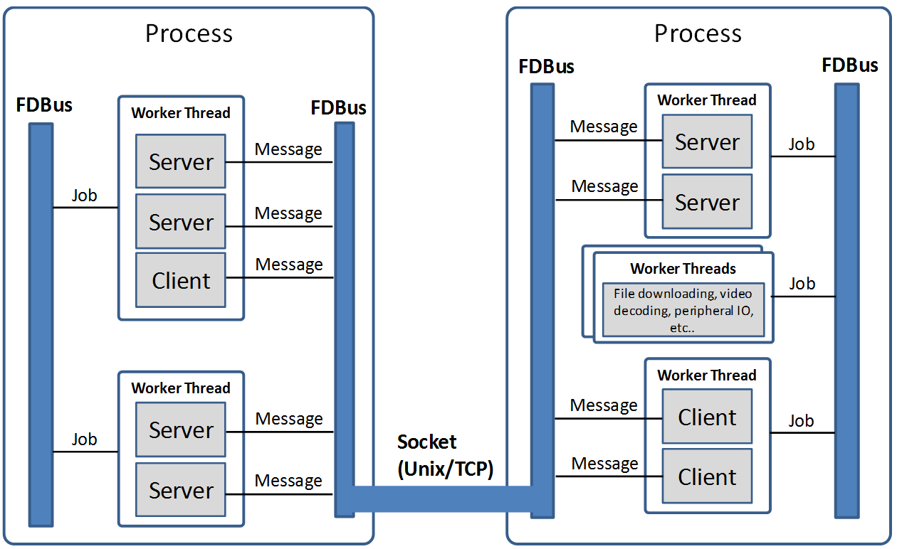
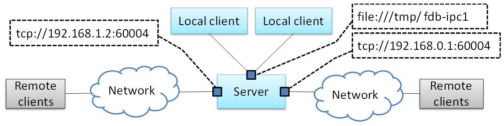
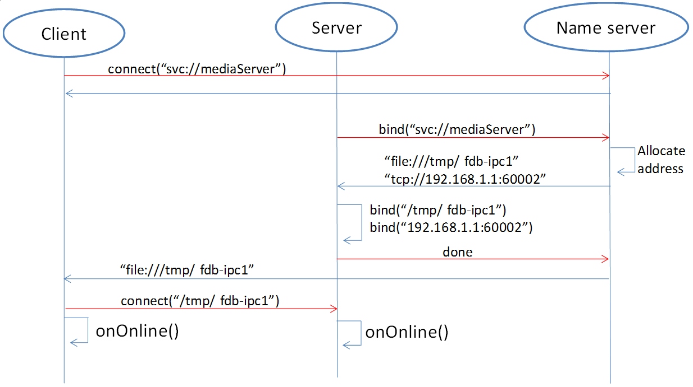
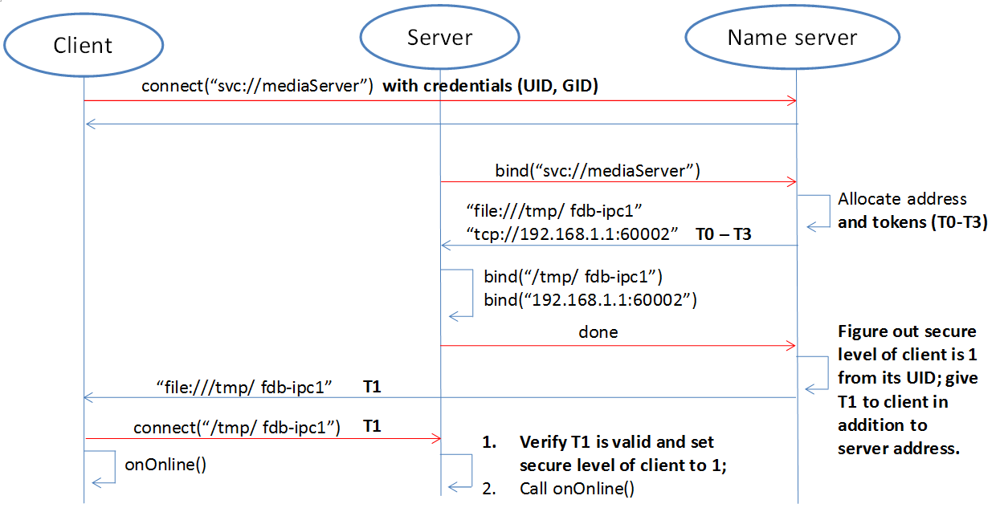
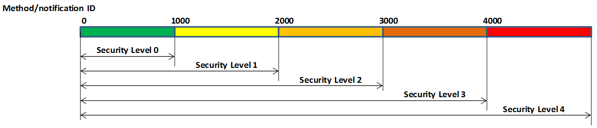
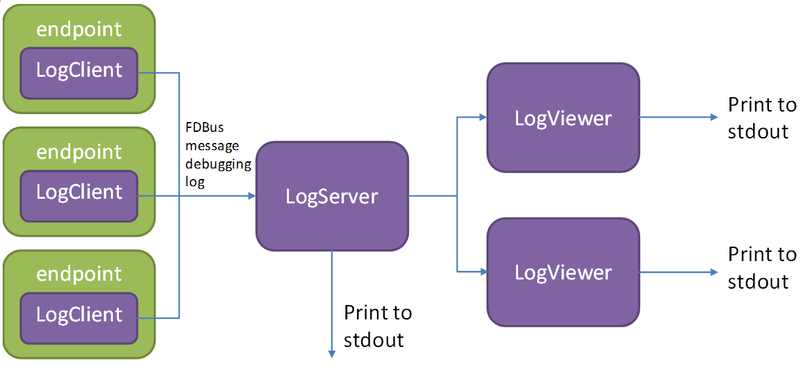
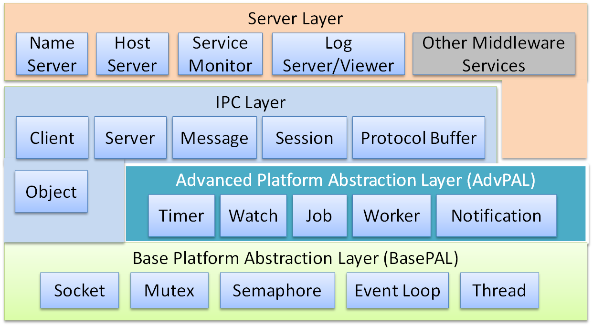

FDBus Manual
============

Abstract
--------

This manual describes a new type of ``IPC`` mechanism: Fast Distributed Bus (``FDBus``). 
From the perspective of ``IPC`` (Inter-Process Communication), ``FDBus`` has similarities 
with widely used ``D-Bus`` (Desktop Bus), but ``FDBus`` has its own advantages, more complete 
functions, higher performance and convenient use. It can also be networked between multiple hosts 
in addition to supporting ``IPC`` in the host. And can customize security policies to support 
different security levels. ``FDBus`` is built on sockets (``Unix`` domain and ``TCP``) and 
serialized and deserialized using Google protobuf. ``FDBus`` supports the name of a string as 
the server address. The ``name server`` automatically assigns a ``Unix`` domain address and a 
``TCP`` port number to the server, so that the addressing between the client and the server 
through the service name can be achieved .

``FDBus`` aims to provide a connection-oriented, scalable, secure and reliable ``IPC`` mechanism 
between client-servers, and then develop into a middleware development framework for cross-platform 
(``Windows``, ``QNX``, ``Linux``), multi-threaded/multi-process middleware layers which working together. 
The ``FDBus`` development framework is suitable for interactive and complex distributed projects 
developed on customization systems, including:

- Linux-based vehicle ``ECU``, including instrument cluster, entertainment host, TBox, 
  domain controller connected via Ethernet
- Communication between multiple Guest OSs on ``Hypervisors``
- Provide cross-host ``IPC`` mechanism for Android system (currently does not support ``Java API``)
- Small communication devices based on ``Linux``, such as home routers
- Other Linux-based industrial equipment, smart equipment
- Automated test equipment based on ``Windows`` development

You may get the open source of ``FDBus`` with Apache License on Github:
  https://github.com/jeremyczhen/fdbus.git

Background
----------

Unlike other cores, ``Linux`` has not had its own unique and easy-to-use ``IPC`` mechanism, 
while ``Windows``, ``Mac OS``, and ``QNX`` all have such a mechanism. Even Linux-based ``Android`` 
has developed a binder for ``IPC``. The ``Linux kernel`` only provides some of the most basic 
components - socket, pipe, message queue, shared memory, and so on. This is also in line with 
the ``Linux`` philosophy which is that each tool only does one thing and does it well. But the 
reality is often very complicated. Just doing one thing is far from solving the problems encountered 
in reality, let alone product development and large commercial projects. For example, 
subscription-broadcasting is a basic communication requirement, but no basic component can satisfy it.

Actually ``Linux`` has a powerful ``IPC``: ``D-Bus``. It has sophisticated method invocation mechanisms 
and event broadcast mechanisms. It also includes advanced features such as security policies and 
on-demand startup of services. But the biggest controversy about it is the performance: its performance is 
very low, due to the daemon relay, a request-reply needs to replicate ten times, four message verification, 
and four context switches. Therefore, it can only be used to handle control commands and message delivery 
with lower real-time requirements and smaller data volume, otherwise it will have to resort to the basic 
``IPC`` framework. For this reason, someone wrote ``D-Bus`` into the kernel and generated ``KDBus``. 
Although the performance is improved, the disadvantages are obvious. It can only be run on a single machine 
and does not support cross-host. In this case, Android's Binder is also sufficient, and Binder has been 
accepted by the kernel. ``KDBus`` has not `"turned positive"` yet. In addition, whether it is ``DBus`` or 
``KDBus``, the provision is still the basic API, and there is still a big gap from the "middleware development 
framework." However, there is an increasing demand from various industries, including the automotive industry, 
so that various ``DBus`` packages are produced: ``Qt DBus``, ``gDBus``, commonAPI, ``DBus-C++``... But these 
packages are either subordinate to the big frame or lack of maintenance, in short, it is not friendly to use.

In the automotive field where ``Linux`` and ``Ethernet`` are used more and more widely, the lack of suitable 
``IPC`` has gradually become a prominent problem: the company's original ``IPC`` mechanism is backward due to 
backward technology and obvious customization, and it has been unable to meet the requirements of distributed, 
high performance and security. However, it is unable to find a suitable ``IPC`` mechanism for the new platform, 
let alone a middleware development framework derived from the ``IPC`` mechanism. The application of ``Ethernet`` in 
vehicle have spawned ``SOME/IP`` (Scalable service-Oriented MiddlewarE over IP). ``SOME/IP`` is also a relatively 
complete ``IPC`` specification, even developed specifically for the automotive industry. But as the name implies, it is 
based on the IP layer and does not perform well on a single machine. And the open sources for ``SOME / IP`` implementation 
are also very few. The GENIVI organization contributed vsomeip, but the activity is very low. ``GENIVI`` itself is a 
loose organization with more participants but fewer developers. Unlike ``DBus``, ``SOME/IP`` is built for vehicle and has 
a narrow range of applications. It is impossible to expect an active community to gather a group of professional 
programmers to maintain open source (this is probably why ``GENIVI`` is unsuccessful). Finally, it is very likely 
that you have to pay for closed source software.

``FDBus`` was developed to solve the above problems and has the following characteristics:

- :command:`Distributed`: Based on ``TCP`` sockets and Unix Domain sockets (``UDS``), it can be used for both local 
  ``IPC`` and ``IPC`` between network hosts.
- :command:`Cross-platform`: Currently verified on ``Windows``, ``Linux`` and ``QNX``
- :command:`High performance`: point-to-point direct communication, not forwarded through a central hub or broker
- :command:`Security`: Ability to configure different levels of access for server method calls and event broadcasts. 
  Only clients with high enough permissions can characterize methods and receive specific events.
- :command:`Service name resolution`: The server address is identified by name, the service is registered by 
  the ``name server``, and the name is resolved, so that the server can be deployed anywhere on the network.
- Support cross-platform middleware development framework, including the following components:
    * 1. Thread model
    * 2. Event Loop
    * 3. Inter-thread communication based on Job-Worker
    * 4. Timer based on Event Loop
    * 5. Watch based on Event Loop
    * 6. Mutex
    * 7. Semaphore
    * 8. Socket
    * 9. Notification
- ``IPC`` adopts Client-Server mode and supports the following communication modes:
    * 1. Synchronous request - reply with timeout
    * 2. Asynchronous request - reply with timeout
    * 3. Unanswered command request
    * 4. Registration-release mode for multicast
- ``IPC`` message implements serialization and deserialization by Protocol buffer. It supports IDL code generation 
  which is efficient and simple. It also supports raw data format and is convenient for large data transmission
- Reliable heartbeat and reconnection mechanisms ensure that all parties remain connected regardless 
  of network conditions, regardless of which service is back online or restarted
- C++ implementation, easy to develop and maintain

Mainstream IPC framework comparison
-----------------------------------

+------+--------+-----------------+---------+--------------+-----------+--------------------+----------+----------+------------+
|      || Bottom| performance     || Sync   || Asynchronous|| Request  ||    Cross-host     || Message || Cross-  || security  |
|      || layer |                 || request||  request    || timed out|                    || push    || platform|| strategy  |
+======+========+=================+=========+==============+===========+====================+==========+==========+============+
|FDBus | Socket || Point-to-point,|   YES   |      YES     |    YES    || YES               || YES     || Window  || YES       |
|      |        || high           |         |              |           || with timeout      || with    || Linux   || Developing|
|      |        || performance,   |         |              |           || and heartbeat     || simple  || QNX     |            |
|      |        || second only to |         |              |           || to ensure reliable|| string  |          |            |
|      |        || Binder         |         |              |           || connection        || matching|          |            |
+------+--------+-----------------+---------+--------------+-----------+--------------------+----------+----------+------------+
|GDBus | Socket || Turned by      |    YES  |      YES     |    YES    || YES               || YES     || Window  || YES       |
|      |        || daemon,        |         |              |           || but need          || with    || Linux   || Developing|
|      |        || lower          |         |              |           || maintaining       || complex || QNX     |            |
|      |        || performance    |         |              |           || reconnection when || matching|          |            |
|      |        |                 |         |              |           || network fails     ||         |          |            |
+------+--------+-----------------+---------+--------------+-----------+--------------------+----------+----------+------------+
|Binder|| Binder|| Direct copy,   |   YES   || YES         || YES      |         NO         || YES     || Only    | YES        |
|      || driver|| highest        |         ||             || but need |                    ||         || Linux,  |            |
|      |        || performance,   |         || but need    || to       |                    || but need|| requires|            |
|      |        ||                |         || callback    || increase |                    || callback|| kernel  |            |
|      |        |                 |         || package     |           |                    || package || driver  |            |
+------+--------+-----------------+---------+--------------+-----------+--------------------+----------+----------+------------+

Middleware model based on FDBus
-------------------------------

The following figure is an example of a middleware layer based on ``FDBus`` development:

The middleware layer contains multiple processes, whether they are on the same host system or 
on different host systems. Each process can run multiple threads. ``FDBus`` runs a specific event 
loop on a thread basis, enhancing the generic thread to a worker thread capable of executing jobs, 
timers, and watches. The two communication parties (client and server) of ``FDBus`` are collectively 
referred to as endpoint. Endpoints can be deployed on different workers; multiple endpoints can also 
share the same worker. "Endpoint deployed on the worker" means that the event processing of the endpoint 
is executed on the worker. For example, the server processes the client request on the specified 
worker; the client processes the asynchronous reply and the broadcast event of the server on the 
specified worker. Middleware developers can use a worker to handle multiple endpoint events 
according to the actual situation, avoiding consuming too many threads, and also avoiding the 
"concurrency disaster" caused by multithreading. Developers can also use multiple workers to serve 
one endpoint. For example, endpoint can create worker threads to complete time-consuming 
file downloads, video codecs, peripheral IO operations, etc..

Multi-threaded collaborative work requires that messages and data could be transferred between threads. 
For example, the endpoint should be notified for subsequent processing if the file is downloaded successfully. 
Because the same address space can be accessed in the process, the best communication carrier is 
the object which can either carry the data or specify the way of data processing. Job is the object that 
``FDBus`` transfers between threads, ``FDBus`` realizes inter-process communication through the transfer 
and execution of jobs between threads.

A more important feature of ``FDBus`` is interprocess communication (``IPC``). Objects cannot be 
directly passed between processes. Processes can only interact in the form of messages. Further more, 
messages need to be serialized during transmission and deserialized after receiving. Each ``IPC`` 
mechanism, including ``Binder``, ``SOME/IP``, and ``DBus``, has its own serialization method. 
The quality of serialization directly affects communication efficiency, load, support for data 
structures, and ease of use. ``FDBus`` does not have its own serialization method, just uses google 
protocol buffer directly which is easy to use, full-featured, and supports idl automatic code generation. 
Data is communicated between processes using sockets, including Unix Domain Sockets (``UDS``) and 
``TCP`` sockets. The system will automatically choose which type to be used according to the deployment 
of Client and Server: ``UDS`` is used if inside the same host, otherwise ``TCP`` socket is used. 
For ``Windows``, since ``UDS`` is not supported, ``TCP`` sockets are used for all.

FDBus addressing and networking
-------------------------------

Server address
^^^^^^^^^^^^^^

The server address is the identifier of the server in the network. Through this identifier, 
the client can find the specified server and establish communication with it. As mentioned 
earlier, FDBus supports ``UDS`` and ``TCP`` sockets, each with its own naming method and namespace. 
For unification, ``FDBus`` uses the following rules to define the server address:

- ``UDS``: file://socket filename
- ``TCP`` socket: tcp://ip address: port number

Different from the socket server in the general sense, the ``FDBus`` server can bind multiple addresses 
at the same time, and each address can accept the connection of the client. Once connected, each address 
provides the same service, so the client can choose any address to establish a connection. The following 
figure is a schematic diagram of the ``FDBus`` server address binding:

In the figure above, the server is bound to a ``UDS`` address: ``file:///tmp/fdb-ipc1``. The client on the 
same host can use this address to initiate a connection. Of course, it can also connect to any other address, 
but undoubtedly the most efficient one is ``UDS``. And ``UDS`` supports peer credentials, and thus support 
security policies. As the host has multiple network ports, the server can also bind one address 
(port number) to each network port: ``tcp://192.168.1.2:60004`` and ``tcp://192.168.0.1:60004``. Each address 
is used to connect to the client of the corresponding network segment.

Server naming and address assignment
^^^^^^^^^^^^^^^^^^^^^^^^^^^^^^^^^^^^

It is inconvenient and not intuitive to use the above address to locate the server. The address will 
change with the networking mode and cannot be deployed flexibly. For this reason, ``FDBus`` has added an 
addressing mode: server name addressing. Each server can have its own name. A service called ``name server``, 
is run to assign addresses to the server, manage the mapping between server names and addresses, parse 
the server name, and issue the server address. The ``name server`` is a bit like the ``DNS`` on the internet. 
To support server name addressing, a format is added to the two URLs as the name address, as follows:

- svc://servername

The name address is a virtual address. No matter where the server is located, as long as its name and address 
are unchanged, the client can establish contact with it through this address. If the server calls ``bind()`` to bind 
the name address (the address starting with svc:// ), the ``name server`` will assign the actual address (the address 
starting with tcp:// or file:// ) to it and register the name and address to the mapping table. If the client connects 
to the name address, the ``name server`` will look up the actual address of the server according to the name and 
select the most appropriate actual address to publish to the client. The client establishes a point-to-point direct 
connection with the server through this address. The following figure shows the process of establishing a connection 
between the client and the server using the name address with the help of the ``name server``:

First, the client calls connect("svc://medisServer") to establish a connection with the server named mediaServer. 
Since the name address is used, ``FDBus`` will ask the ``name server`` for the actual address of the mediaServer. 
But now mediaServer is not online yet, so the name cannot be resolved, just subscribe to the online 
notification of the service. Soon after, the server calls bind("svc://mediaServer") to be online. 
Since the name address is used, the request will also be sent to the ``name server``. The ``name server`` 
registers its name, assigns ``UDS`` and ``TCP`` addresses, and returns them to the server. The server is 
bound to each actual address, and the ``name server`` is notified after success. The ``name server`` 
issues the server online message and the server address to the entire system: the ``UDS`` address is 
broadcast to the local client, and the ``TCP`` address is broadcast to the clients on other nodes. 
The client establishes a connection with the server using the received address, and both the client and 
the server can receive the event notification of onOnline().

The ``name server`` uses the following rules to assign a server address:

+--------------+------------------------------+-----------------+
| Server       |         TCP Address          |   UDS Address   |
+==============+==============================+=================+
| host server  |        port No. 6100         |   /tmp/fdb-ns   |
+--------------+------------------------------+-----------------+
| name server  |        port No. 6101         |   /tmp/fdb-ns   |
+--------------+------------------------------+-----------------+
| user servers || Port 61002 – Port 65535     || /tmp/fdb-ipc0, |
|              || or                          || /tmp/fdb-ipc1, |
|              || Automatic system allocation || ...            |
+--------------+------------------------------+-----------------+

Multi-host networking
^^^^^^^^^^^^^^^^^^^^^

Since the address of the ``name server`` is fixed, the endpoint will automatically connect to the ``name server`` 
registration (server) or resolution (client) name after the endpoint is started. If there are multiple hosts, 
each running their own ``name server``, responsible for their respective name services, then these hosts 
become isolated islands and cannot be connected to each other through service names such as svc://server_name. 
Of course, the client can bypass the ``name server`` and directly connect to the server with the actual 
address, but this cannot be flexibly deployed and networked. In order to support name resolution across 
networks, a service is required to manage all hosts in the system, and the host information is synchronized 
to all ``name servers``. These ``name servers`` can establish connections and work together to complete the name 
service within the entire network. This service is the ``host server``.

The working principle of the ``host server`` is: the entire network runs a ``host server``, which can be located 
on any host that everyone can access. All host name servers are connected to the ``host server``, registering 
their own host. The ``host server`` maintains a list of hosts containing the IP addresses of the hosts and 
synchronizes the tables to all ``name servers`` on the network. The ``name server`` establishes a connection 
with the ``name server`` on all hosts in the network according to the table.

Once the ``name servers`` on all hosts are connected in pairs, the service name resolution and service 
online notification can be completed through a set of internal protocols. For example, when a client on 
a host requests the local ``name server`` to resolve the address corresponding to the service name, the local 
``name server`` can broadcast the request to all connected ``name servers`` to find services in the entire 
network. The following is an example diagram of the entire system networking:

.. image:: ./images/4.png
  :width: 600px

In the above figure, a star connection is established between the ``name server`` and the ``host server``, 
and the ``name server`` and the ``name server`` are connected one by one to form a network. 
In this system, the main tasks of the ``name server`` and ``host server`` are:

- ``Name server`` connects to the ``host server``, and the host is registered to the ``host server``.
- The ``host server`` collects all host information to form a host address table.
- The ``host server`` broadcasts the host address table to all name servers.
- ``Name server`` gets the address of the name servers on the other hosts through the table and 
  establish the connection with it.
- All servers are connected to the local ``name server`` and register the service name with them. 
  The local ``name server`` broadcasts the newly registered service to the local client and all 
  other ``name servers`` in the network.
- After the other ``name server`` receives the broadcast, it also makes a broadcast locally and 
  notifies all clients. In this way, the service online message is spread to the entire network.
- All clients are connected to the local ``name server`` and apply for service name resolution. 
  The local ``name server`` searches its own server address mapping table and sends the application 
  to all other ``name servers``.
- After receiving the application, other ``name servers`` search their respective server address 
  mapping tables and return the result to the ``name server`` that initiated the application.
- The ``name server`` forwards the received return result to the client that initiated the application, 
  and the client establishes a direct connection with the service using the actual address in the result. 
  In this way, you can find all services on all hosts.

As can be seen from the above figure, once the connection is established between the client and the server, 
all communication is completed through this connection without forwarding through the intermediate link.

Uniqueness of the service name
^^^^^^^^^^^^^^^^^^^^^^^^^^^^^^

Since each host has its own ``name server``, the service cannot be renamed inside the host, but it can be 
renamed on different hosts. In this case, when the client requests name resolution, it may receive feedback 
from different hosts. The client can customize the connection policy: always connect to the new server, 
only connect to the first server, or only connect to the specified server.

Heartbeat detection, reconnection and online, offline detection
^^^^^^^^^^^^^^^^^^^^^^^^^^^^^^^^^^^^^^^^^^^^^^^^^^^^^^^^^^^^^^^

In order to make the whole system run reliably and ensure that any service can be gracefully restarted 
(the entire system still works normally after restarting), ``FDBus`` has perfect heartbeat detection and 
online and offline detection mechanisms:

- There is a reconnection mechanism between endpoints and ``name server`` to ensure that the endpoint 
  can always establish a connection with the ``name server`` after restarting.
- There is heartbeat detection between the ``name server`` and the ``host server``. Once the heartbeat 
  disappears, the ``name server`` will try to reconnect with the ``host server`` to ensure the reliability of 
  the connection between the ``name server`` and the ``host server``.
- The connection between the ``name server`` and the ``name server`` is established by the ``host server``: 
  When the ``name server`` goes online, the ``host server`` notifies all other ``name servers`` to establish a 
  connection with it, and also informs the ``name server`` to establish a connection with all other 
  ``name servers``.
- The connection between the client and the server is established by the ``name server``: When the server 
  goes online, the ``name server`` notifies the client to establish a connection with it.

Security
--------

As systems become more complex and open, security has become the focus of system architecture design. 
An open system means that there may be intruders, and once an intruder accesses a resource that should 
not be accessed, it may cause information leakage or destruction. On the other hand, the security of a 
system is based on the chain of trust, and only by satisfying the necessary security foundation can build 
its own security capabilities. For ``FDBus``, there are two prerequisites:

| The most basic premise is the integrity of the ``FDBus`` itself: the ``FDBus`` library running in the 
  system, the ``name server``, and the ``host server`` are all legal and have not been tampered with or replaced, 
  otherwise security cannot be guaranteed anyway. This is ensured by the operating system with rights 
  management, secure boot, ``DM-verity/FS-verity``, security upgrade, SELinux and other mechanisms.

| Secondly, on the network, the ``FDBus`` message is delivered in plain text. Once someone illegally 
  listens to the network message, it may cause information leakage and security loopholes. Therefore, 
  another premise to discuss the security of ``FDBus`` is that the intruder cannot intercept the network 
  packet and obtain the data transmitted by the ``FDBus`` on the link. Key data such as tokens will be 
  encrypted in the future, but it has not been implemented yet.

Based on these assumptions, the attacks faced by ``FDBus`` mainly come from three aspects:

| 1) An illegal host connects to the ``FDBus`` bus and runs an illegal client to access the server on other hosts; 
| 2) Runs an illegal client on a legitimate host to access the ``FDBus`` server in the host
| 3) A legal client is running on a legal host, but tries to get data without permission or 
  perform an operation without permission.

Based on the above attacks, ``FDBus`` ensures the safe operation of the system from the following aspects:

- **Authentication of the host node**: All hosts joining the ``FDBus`` are divided into different security levels.
- **Authentication of service access**: All clients are divided into different security levels
- **Access restrictions**: The server's method calls and event broadcasts are divided into different security levels,
  so that the client can call the method that matches the server security level and the event broadcast that 
  matches the registration.

Host node authentication
^^^^^^^^^^^^^^^^^^^^^^^^

A host must establish a connection with the ``host server`` if it wants to join the ``FDBus``. The ``host server`` 
can authenticate the host by checking the host's IP address or MAC address, and can also determine the 
validity of the host through the public-private key pair. For a legitimate host, the ``host server`` will 
issue an "``ID card``" for accessing other hosts. After holding the ``ID card``, the hosts can identify each 
other and give each other access rights.

"``ID card``" is implemented by token. When the ``name server`` on the host initiates a connection, 
the ``host server`` will assign multiple tokens to it, and each token corresponds to a security level. The following 
table shows the token assignments for each host in a system:

+--------+------------------+------------------+------------------+------------------+
|        | Security Level 0 | Security Level 1 | Security Level 2 | Security Level 3 |
+========+==================+==================+==================+==================+
| host 1 | token10          | token11          | token12          | token13          |
+--------+------------------+------------------+------------------+------------------+
| host 2 | token20          | token21          | token22          | token23          |
+--------+------------------+------------------+------------------+------------------+
| host 3 | token30          | token31          | token32          | token33          |
+--------+------------------+------------------+------------------+------------------+

There are four security levels in the table. For host 1, the tokens corresponding to each security level 
are token10, token11, token12, and token13. For other hosts, and so on. When the ``name server`` of the host 2 
is connected to the ``name server`` of the host 1, it needs to hold one of the four tokens of the host 1. 
For example, host 2 uses token 11 to connect to host 1, then in the eyes of host 1, the security level 
of host 2 is 1; if token13 is used, the security level of host 2 is 3, and so on. The number of security 
levels can be configured according to the project.

The security level of the host is specified after the ``host server`` identifies and authenticates the host. 
As mentioned above, the ``host server`` can identify the host identity according to the host's MAC address or 
other means, and then use the following configuration table to publish the tokens used by the hosts to 
access each other:

+-----------------------+---------+---------+---------+
|                       | host 1  | host 2  | host 3  |
+-----------------------+---------+---------+---------+
| host 1 (MAC address1) | NA      | token22 | token31 |
+-----------------------+---------+---------+---------+
| host 2 (MAC address2) | token13 | NA      | token33 |
+-----------------------+---------+---------+---------+
| host 3 (MAC address3) | token12 | token23 | NA      |
+-----------------------+---------+---------+---------+

For example:

| 1) Host 1 connects to host 2 using token22, that is, for host 2, host 1 has a security level of 2;
| 2) when host 1 connects to host 3, token31 is used, that is, for host 3, The security level of host 1 is level 1.

And so on. For hosts that are not in the table, the ``host server`` will not reject the connection for the sake of 
openness, but will not issue a token for it. For hosts that do not have a token, the security level is considered 
to be -1 and there is no level.

Service access authentication
^^^^^^^^^^^^^^^^^^^^^^^^^^^^^

Just as the ``host server`` is responsible for host authentication, the ``name server`` is responsible for the 
authentication of the service access, and also uses the certification authentication + token issuing method. 
When the server registers the service name with the ``name server``, the ``name server`` allocates multiple 
tokens at the same time as the address is assigned, and each token corresponds to a security level, as shown 
in the following table:

+----------+------------------+------------------+------------------+------------------+
|          | Security Level 0 | Security Level 1 | Security Level 2 | Security Level 3 |
+----------+------------------+------------------+------------------+------------------+
| server 1 | token10          | token11          | token12          | token13          |
+----------+------------------+------------------+------------------+------------------+
| server 2 | token20          | token21          | token22          | token23          |
+----------+------------------+------------------+------------------+------------------+
| server 3 | token30          | token31          | token32          | token33          |
+----------+------------------+------------------+------------------+------------------+

There are four security levels in the table. For server1, the tokens corresponding to each security level 
are token10, token11, token12, and token13. For other servers, and so on. When the client connects to server1, 
it needs to hold one of the four tokens of server1. For example, if the client uses token11 to connect to 
server1, then in the eyes of server1, the client's security level is 1. If token13 is used, then the client's 
security level is 3, and so on. The number of security levels can be configured as appropriate.

The security level of the host is specified after the ``host server`` identifies and authenticates the host. 
When the client connects to the ``name server`` through the UDS, the UDS will also send the client's 
credentials to the ``name server``, including the client's uid and guid. Windows does not support ``UDS``, so 
it doesn't support service access authentication. For ``QNX``, although ``UDS`` is supported, service access 
authentication is not supported because the ``SO_PEERCRED`` option is not supported. So currently only Linux 
can support, and the credentials are attached by the operating system which is trustworthy, the client can not 
fake an identity. According to uid and guid, the ``name server`` can identify the identity of the client, and 
publish the token used to access other servers through the following configuration table:

+----------------------+---------+---------+---------+---------+
|                      | server1 | server2 | server3 | server4 |
+----------------------+---------+---------+---------+---------+
| client1 (uid1:guid1) | token12 | token22 | token31 | token43 |
+----------------------+---------+---------+---------+---------+
| client2 (uid2:guid2) | token13 | token21 | token33 | token43 |
+----------------------+---------+---------+---------+---------+
| client3 (uid3:guid3) | token12 | token23 | token33 | token41 |
+----------------------+---------+---------+---------+---------+

For example:

| 1) Client1 connects to server1 using token12, that is, for server1, client1 has a security level of 2; 
| 2) Client1 connects to server2 using token22, that is, for server2, client1 has a security level of 2 .

And so on. For clients that are not in the table, the ``name server`` will not reject the connection for 
the sake of openness,but will not issue tokens for it. For clients without a token, the security level is 
considered to be -1, the lowest level.

When the security policy is enabled, the process of establishing a connection between the client and the 
server increases the client authentication and token issuance process, as shown in the following figure:

Compared with the previous timing, in the above figure, the ``name server`` issues tokens to the server 
and the client respectively: all the security level tokens T0-T3 are issued to the server; only the token 
matching the security level is issued to the client. When the client connects to the server, it will also 
send the token to the server. The server finds that the received token is consistent with T1 by comparison, 
so that the client's security level is 1. Suppose a malicious client also connects to the same server: 
Since the ``name server`` can not recognize its ``UID``, it will not be assigned a token. When the client 
trying to connect to the server, the server sets its security level to -1 because the token cannot be given, 
that is, no security level, . In this case, by configuring the server, the client can only be allowed to access 
to a limited API, so that the access control is realized.

Security level and access rights
^^^^^^^^^^^^^^^^^^^^^^^^^^^^^^^^

When determining the security level of the client, the server needs to integrate the security level of 
the client itself and the security level of the host where the client is located: the highest security 
level of the client does not exceed the security level of the host where it resides. With a security 
level, the server can define different levels of access: at which levels, which methods can be called, 
and which broadcast messages are monitored. The following figure shows the partitioning of a server's 
access rights:

Each server can define access rights corresponding to different security levels through the configuration 
file. The specific method is to segment the method ID and the notification ID, and the IDs falling in 
different segments correspond to different security levels. For the method call, if the security level 
of the client does not reach the required level, the server will refuse to execute; for the message 
notification, if the client does not have the permission, the message of the high security level cannot 
be registered, and thus the change notification of the message will not be received.

Security policy configuration file
^^^^^^^^^^^^^^^^^^^^^^^^^^^^^^^^^^

The security policy file is located under ``/etc/fdbus`` by default.

Parameter configuration file /etc/fdbus/fdbus.fdb
"""""""""""""""""""""""""""""""""""""""""""""""""

This file configures the overall security parameters, including the following fields:

- **number_of_secure_levels**: number type, how many security levels are configured
- **token_length**: number type, configured for the length of the token in bytes.

Host configuration file /etc/fdbus/host.fdb
"""""""""""""""""""""""""""""""""""""""""""

This file configures the security parameters of each host, including the following fields:

- **host**: object type, the key of each element is the host name ("host_name"), and the value 
  is the array type, which contains the security policy of the corresponding host.
- **host."host_name"[...]**: object type, which indicates the configuration of a security level.
- **host."host_name"[...].level**: number type, indicating the security level.
- **host."host_name"[...].ip**: array type, each element is the host ID represented by the IP address, 
  meaning: the host with these IP addresses, the security level is ``host."host_name"[...].level``. 
  If the IP is a "default" string, it means that there is no default security level for the host in 
  the configuration file.
- **host."host_name"[...].mac**: array type, each element is the host ID represented by the MAC address, 
  meaning the same as ``host."host_name"[...].ip``.

Server Configuration file /etc/fdbus/server/server_name.fdb
"""""""""""""""""""""""""""""""""""""""""""""""""""""""""""

The Server configuration file is located in the ``/etc/fdbus/server`` directory. Each server has a 
configuration file. The file name specification is: ``server_name+.fdb suffix``, which contains the 
following fields:

- **method**: array type, the security policy that the configuration method calls.
- **method[...]**: object type, defines the security policy for a collection of methods.
- **method[...].level**: number type, indicating the security level
- **method[...].from**: number type, which represents the minimum value of the method set. If it 
  is a "default" string, it means that there is no default security level for the configuring method.
- **method[...].to**: number type, which represents the maximum value of the method set. The 
  overall meaning is: If a method ID is greater than or equal to **method[...].from**, less than 
  or equal to **method[...].to**, its security level is **method[...].level**. Only clients with a 
  security level greater than or equal to this level can call methods in this range.
- **event**: array type, similar to the method except that it is configured with a 
  security policy for broadcast monitoring. Only clients that meet the security level have 
  the right to listen to the corresponding event.
- **permission**: array type, configuring the access permissions of the server.
- **permission[...]**: object type, which defines the configuration of a security level.
- **permission[...].level**: number type, indicating the security level.
- **permission[...].gid**: array type, if the element is string type, it means group name, 
  if it is number type, it means group id. The meaning of the security policy is: If a client 
  is in a certain group specified by the array, its security level is **permission[...].level**. 
  If the field is a "default" string, it means that the client's default security level cannot 
  be found for the security policy.
- **permission[...].uid**: array type, if the element is string type, it means user name, if it 
  is number type, it means user id. The meaning of the security policy is: If the client id of 
  a client is contained in an array, its security level is **permission[...].level**.

Debugging and logging
---------------------

The ``DBus`` monitor from ``DBus`` is impressive: it can crawl all the messages on the ``DBus`` bus, 
and it can also set filters to crawl specific messages. The captured messages are very readable, 
and various data structures and field names can be displayed. Similarly, ``FDBus`` also provides a 
tool for crawling messages - log server, and its function is stronger. In addition to ``FDBus`` 
messages, it also supports debugging log output, and combines ``FDBus`` messages and debug logs to 
facilitate timing analysis.

The log server is a normal server that mounted on the ``FDBus``. Each endpoint contains its client, 
as shown in the following figure:

Like the normal server, the log server runs up and registers with the ``name server``, which broadcasts 
the LogClient in each endpoint. Later, when the endpoint sends an ``FDBus`` message, it will also send
a copy to the log server through LogClient. In addition to the ``FDBus`` message content, the sent 
data also includes:

- Timestamp
- Transmitter and receiver names
- Message type (request, reply, broadcast, subscription, etc.)

The protocol buffer is transmitted in binary format on the line and cannot be printed directly. 
For debugging convenience, the protocol buffer can convert the message into a text format that 
is easy to read, visually display the name and value of each member in the message, and expand 
the array type (repeated type) and nested type.

For debug log output, ``FDBus`` has its own API and supports the following output levels 
(In ascending order of priority):

- Debug
- Information
- Warning
- Error
- Fatal

As long as the log server is started, when the endpoint prints the debug log through the API, 
these logs are sent to the log server through LogClient. The log server can combine the debug 
log and the ``FDBus`` message to output, or can choose to output specific content separately.

Regardless of which host the endpoint is deployed on, the log server can collect its ``FDBus`` 
messages and debug logs. The entire system can only run one log server, which is not convenient 
for distributed debugging. To this end, ``FDBus`` has another tool - log viewer, multiple log viewers 
can be started at the same time, all connected to the log server, get the current log information, 
and print on the standard output.

FDBus internal structure
------------------------

The following figure is a block diagram of the internal components of ``FDBus``:

- **Base platform abstraction layer** - contains system-independent abstractions for adapting to different operating systems
- **Advanced platform abstraction layer** - a middleware process model that contains the basic components that make up a process
- **IPC layer** - interprocess communication model, including the basic components for implementing ``IPC`` communication
- **Server layer** - provides service name resolution, networking, logging and debugging services

Conclusion
----------

``FDBus`` provides a distributed ``IPC`` communication mechanism to support client-server communication 
across hosts, using service names instead of physical addresses as addressing modes, ensuring connectivity 
dynamics and reliability through various services and heartbeat reconnection mechanisms, thereby ensuring 
the nodes inside the system can be dynamically added and deleted, dynamically deployed, and arbitrarily 
restarted without managing the startup sequence and dependencies, thereby binding the separate modules 
together to form a solid whole. As an important part of ``IPC``, protocol buffer supports a variety of complex 
data types, can define interfaces with idl and support automatic code generation, greatly reducing the job of 
serialization and deserialization. ``FDBus`` supports security policies, differentiates security levels from 
access, and ensures the security of the entire system.

``FDBus`` is not only an ``IPC`` mechanism, but also a middleware development framework, which contains common 
components and basic models that are often used in the development of middleware, providing cross-platform 
and powerful support for middleware development.

The source code of ``FDBus`` is open now, which expects more developers to use, test and improve, and become one 
of the options for many middleware development frameworks.

